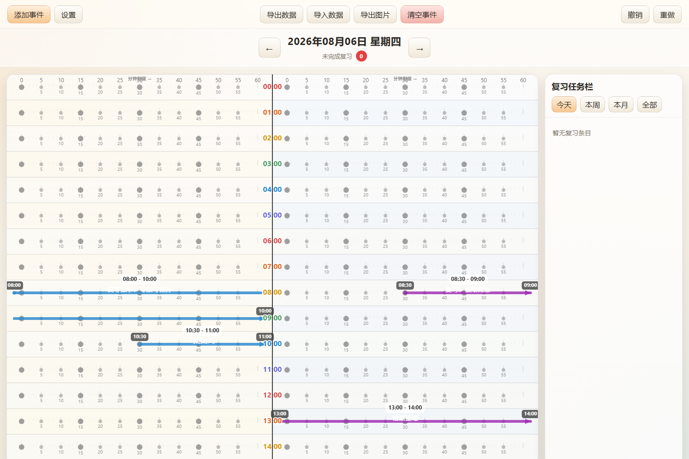

# 学习计划时间轴

一个纯前端的学习计划管理工具：以双栏时间轴（计划区 / 记录区）展示每日学习与复习任务，支持事件时间拖选、冲突检测、复习计划与数据备份。

## 项目截图



## 功能特性

- **双栏时间轴**：左侧为计划区（学习任务），右侧为记录区（复习任务）；两栏宽度占比可在设置中调整（20% - 80%）
- **事件箭头**：每个事件在对应时间段内绘制为水平箭头，支持跨小时事件（每行一段，无垂直连线）；结束时间为整点时箭头自动停留在上一行行尾
- **分钟刻度**：左右半区各自按自身宽度绘制分钟刻度（点、刻度线、顶部标签），随占比调整同步缩放
- **任务类型**：学习任务 / 复习任务 / 自定义，添加事件时按类型自动选择半区（学习→计划区，复习→记录区）
- **冲突检测**：同一日期同一半区内时间重叠时给出冲突提示，并以红色虚线边框标记
- **交互方式**：
  - 单击箭头选中事件
  - 双击箭头编辑事件（检测范围为箭头所在时间区域，整行高度，随行高变化）
  - 右键弹出上下文菜单（修改起始 / 结束时间、删除）
  - 悬停事件右上角出现快速删除按钮
- **时间点选**：设置中可选 1 / 2 / 5 / 10 / 15 / 30 分钟间隔的刻度点，单击小时行中的点选择事件起止时间
- **复习任务栏**：按今天 / 本周 / 本月 / 全部筛选，显示未完成复习数量角标
- **数据管理**：自动备份（localStorage）、手动导出 / 导入 JSON、导出时间轴图片（PNG）、撤销 / 重做、一键清空事件
- **外观定制**：起始小时、行高、隐藏时段、复习颜色 / 透明度、任务类别（名称、颜色、透明度）、事件文字（内容、大小、颜色、透明度）

## 使用说明

1. 直接用浏览器打开 `index.html` 即可使用（无需安装、无需构建、无网络依赖）
2. 点击工具栏 **添加事件** 打开事件表单：
   - 选择半区（或按任务类型自动选择）
   - 输入开始 / 结束时间（时、分）
   - 选择类别，填写文字描述
   - 点击 **保存**
3. 时间轴上点击刻度点快速选择时间范围（先点起始点，再点结束点）
4. 单击选中事件后可通过右键菜单编辑或删除
5. 点击 **设置** 调整时间轴外观与类别；点击 **导出图片** 可将当前时间轴保存为 PNG

## 数据说明

- 所有数据保存在浏览器 `localStorage`（键 `learning_tool_backup`），清除浏览器数据前请先 **导出数据**
- 使用 **导入数据** 可恢复备份

## 目录结构

```
学习计划/
├── index.html        # 主页面
├── app.js            # 全部应用逻辑（绘制、交互、数据）
├── styles.css        # 样式
├── screenshots/
│   └── demo.png      # 项目实例截图
└── README.md
```

## 技术说明

- 纯原生 HTML / CSS / JavaScript（Canvas 2D 绘制），无任何第三方依赖
- 时间轴基于 Canvas 渲染，按小时行布局；支持设备像素比（devicePixelRatio）高清显示
- 事件时间以"当天第 N 分钟"（slot）为单位存储，便于冲突检测与小时网格对齐
